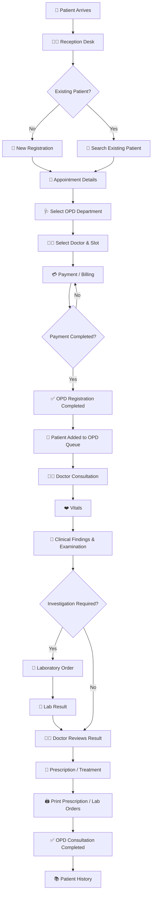
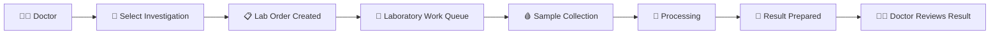
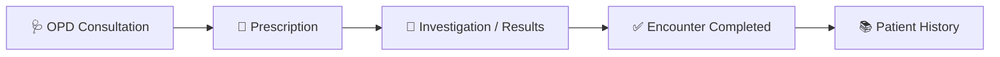
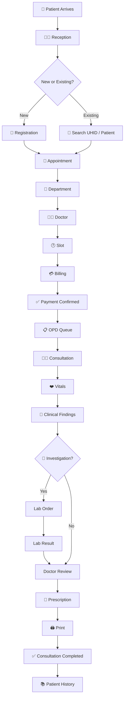

# 🏥 Arovita HMS — OPD Patient Journey

> **Purpose:** Internal development documentation  
> **Module:** OPD Patient Journey  
> **Scope:** Reception → Registration → Billing → Doctor Consultation → Laboratory → Prescription → Completion → Patient History

---

## 🟢 1. OPD Journey — Overview

The OPD journey starts when a patient reaches the Reception Desk and ends when the OPD consultation is completed and the completed visit is added to **Patient History**.

### 🔄 High-Level Flow



---

# 🟦 2. Step 1 — Reception Desk

## 🎯 Purpose

The receptionist starts the OPD journey.

The first step is to determine whether the patient is:

- 🆕 New Patient
- 🔄 Existing Patient

### Flow

```text
Patient Arrives
      ↓
Reception Desk
      ↓
Search Patient
      ↓
Existing Patient?
   ↙          ↘
 No            Yes
 ↓              ↓
New          Existing
Registration  Profile
      ↓          ↓
      Appointment
```

---

# 🟦 3. Step 2 — Patient Registration

## 🆕 New Patient

The receptionist enters the required patient profile information.

Typical information:

- Patient Name
- Date of Birth / Age
- Gender
- Mobile Number
- Address
- Emergency Contact
- Other hospital-required demographic details

After registration, the system generates the patient's **UHID / Patient ID**.

## 🔄 Existing Patient

The receptionist searches using the available patient identifier, such as:

- UHID
- Patient ID
- Mobile Number
- Patient Name

The existing patient profile is loaded.

> **Important:** Existing patient information should not be recreated. The appointment should be linked to the existing patient profile.

---

# 🟦 4. Step 3 — Appointment Details

After the patient profile is selected/created, the receptionist enters the visit details.

### Required Information

| Field | Example |
|---|---|
| Visit Type | OPD |
| Department | Cardiology |
| Doctor | Dr. Rajesh |
| Date | 08-Aug-2026 |
| Slot | 10:30 AM |
| Consultation Type | New / Follow-up |
| Patient Category | Cash / Insurance / Corporate / Employee |

### Flow

```text
Patient Profile
      ↓
Visit Type = OPD
      ↓
Department
      ↓
Doctor
      ↓
Available Slot
      ↓
Consultation Details
      ↓
Billing
```

---

# 🟦 5. Step 4 — OPD Billing & Payment

The system retrieves the applicable OPD tariff from the **Pricing & Billing Engine**.

The amount can depend on:

- Department
- Doctor Level
- Consultation Type
- Patient Category
- Tariff Plan
- Applicable discounts/taxes

### Billing Flow

```text
Appointment Details
        ↓
Pricing Engine
        ↓
Applicable OPD Tariff
        ↓
Consultation Amount
        ↓
Discount / Tax (if applicable)
        ↓
Final Amount
        ↓
Payment Mode
        ↓
Payment Confirmation
```

### Payment Modes

- 💵 Cash
- 📱 UPI
- 💳 Card
- 🏦 Online Payment
- 🧾 Corporate / Credit
- 🛡️ Insurance, where applicable

---

# 🟩 6. Step 5 — OPD Registration Completed

Only after the required billing/payment process is successfully completed:

```text
Payment Confirmed
      ↓
OPD Visit Created
      ↓
OPD Encounter ID Generated
      ↓
Patient Added to OPD Queue
      ↓
Doctor Queue Updated
```

The patient should now be visible to the concerned:

- 👨‍⚕️ Doctor
- 👩‍⚕️ Assigned Nurse, if applicable
- 👩‍💼 Receptionist / OPD Desk

---

# 🟨 7. Step 6 — Doctor OPD Queue

The doctor sees the patient's appointment in the OPD queue.

### Suggested Status

```text
BOOKED
  ↓
CHECKED-IN
  ↓
WAITING
  ↓
IN-CONSULTATION
  ↓
COMPLETED
```

The doctor opens the patient profile from the queue.

---

# 🟨 8. Step 7 — Doctor Consultation

The doctor reviews the patient and records the clinical information.

## 👨‍⚕️ Consultation Components

### ❤️ Vitals

Examples:

- Blood Pressure
- Pulse
- Temperature
- SpO₂
- Respiratory Rate
- Weight
- Height
- BMI

### 📝 Clinical Information

- Chief Complaint
- History
- Clinical Findings
- Physical Examination
- Diagnosis
- Doctor Notes
- Clinical Impression

---

# 🟧 9. Step 8 — Laboratory / Investigation

If the doctor requires investigations, the doctor creates a laboratory order.



The laboratory result becomes part of the patient's clinical record.

### Important

The laboratory workflow should be connected through the **patient + encounter/order ID**, so the result is attached to the correct OPD visit.

---

# 🟧 10. Step 9 — Prescription & Treatment

After reviewing the clinical findings and investigation results, the doctor records the treatment plan.

### Prescription may contain

| Information |
|---|
| Medicine |
| Dose |
| Route |
| Frequency |
| Duration |
| Instructions |
| Remarks |

The prescription is saved against the patient's OPD encounter and becomes part of the patient's longitudinal medical history.

---

# 🟪 11. Step 10 — Printing

Printing should be available from the appropriate screens.

## 👩‍💼 Reception Desk

Reception can print:

- 🧾 OPD Invoice / Receipt
- 📅 Appointment Details
- 🪪 Registration Information, if required

## 👨‍⚕️ Doctor

Doctor can print:

- 💊 Prescription
- 🧪 Laboratory Orders / Investigation Requests
- 📄 Consultation Summary, if required

The print action should use the same saved record from the backend rather than creating a separate document manually.

---

# 🟩 12. Step 11 — OPD Consultation Completion

The doctor completes the OPD encounter after the consultation and required clinical documentation are finished.

```text
Clinical Documentation Completed
          ↓
Prescription Completed
          ↓
Investigation Orders/Results Recorded
          ↓
Doctor Completes Consultation
          ↓
Encounter Status = COMPLETED
          ↓
OPD Queue Updated
          ↓
Patient History Updated
```

---

# 📚 13. Step 12 — Patient History

Once the OPD encounter is completed, it becomes part of the patient's history.

The history should contain:

- Patient Profile
- OPD Visit
- Doctor
- Department
- Consultation Notes
- Diagnosis
- Vitals
- Prescription
- Laboratory Orders
- Laboratory Results
- Documents
- Billing Information
- Visit Date
- Encounter Status

### Final Flow



---

# 🔔 14. Real-Time Notifications

When important workflow actions occur, the relevant dashboards should receive real-time updates.

| Event | Notification / Update |
|---|---|
| OPD Payment Completed | Doctor Queue Updated |
| Patient Checked In | Doctor Queue Updated |
| Consultation Started | Queue Status Updated |
| Lab Order Created | Laboratory Worklist Updated |
| Lab Result Ready | Doctor Notified / Result Available |
| Prescription Completed | Patient Record Updated |
| OPD Completed | Patient History Updated |

### WebSocket Principle

```text
REST API
   ↓
Save / Update Database
   ↓
Transaction Successful
   ↓
WebSocket Event
   ↓
Relevant Dashboard Updated
```

WebSocket is used for **real-time updates**, while the backend API/database remains the source of truth.

---

# 🧩 15. Complete OPD Journey



---

# 🔑 16. Important System Rules

1. **One patient → one permanent UHID.**
2. Every OPD visit should have a unique **Encounter/Visit ID**.
3. Existing patients should not be registered again.
4. OPD queue should be created only after the appointment/visit is successfully confirmed according to the hospital's billing policy.
5. Doctor consultation data must be linked to the correct encounter.
6. Lab orders and results must be linked to the patient and encounter.
7. Prescription must be stored against the encounter.
8. Completed OPD encounters move to Patient History.
9. Historical records should not be overwritten by future visits.
10. Print documents should be generated from saved backend data.
11. Real-time notifications should be sent only after the underlying transaction succeeds.
12. Role/department permissions must control who can view or modify clinical information.

---

# 🏁 Final OPD Journey

```text
🧑 Patient
   ↓
👩‍💼 Reception
   ↓
📝 Registration / Existing Patient
   ↓
📅 Appointment
   ↓
🏥 Department + 👨‍⚕️ Doctor + 🕐 Slot
   ↓
💳 Billing & Payment
   ↓
📋 OPD Queue
   ↓
👨‍⚕️ Doctor Consultation
   ↓
❤️ Vitals
   ↓
📝 Clinical Findings
   ↓
🧪 Lab Investigation (if required)
   ↓
📄 Lab Results
   ↓
💊 Prescription
   ↓
🖨️ Print
   ↓
✅ OPD Completed
   ↓
📚 Patient History
```

> **Core concept:** The OPD journey should be driven by the **Patient + Encounter ID**. Reception creates the encounter, the doctor manages the clinical encounter, laboratory adds investigation results to the same encounter, and completion closes the encounter and makes it part of the patient's permanent history.
